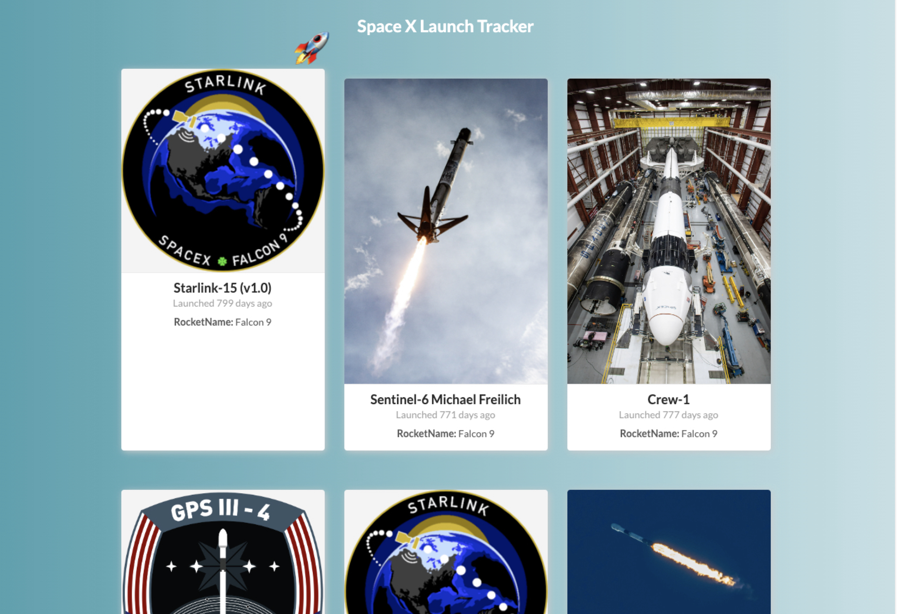

# Space X Launch Tracker
## Goal

Our goal is to make a React app with a list of the past SpaceX launches along with an associated details page. Data is provided via the [SpaceX](https://api.spacex.land/graphql/) GraphQL API and. We use the [Apollo Client](https://www.apollographql.com/) Provider and the useQuery hook to access data from the frontend.

## Visual


## Install

Install [npm](https://npmjs.org/) run

```
$ npm install -g npm
```

Install [Node](https://nodejs.org/en/download/)

## Usage
Clone Repo to your local machine

```
git clone
```
Install Dependencies
```
npm install
```

start the development server
```
npm start
```

Open [http://localhost:3000](http://localhost:3000) to view it in the browser.

